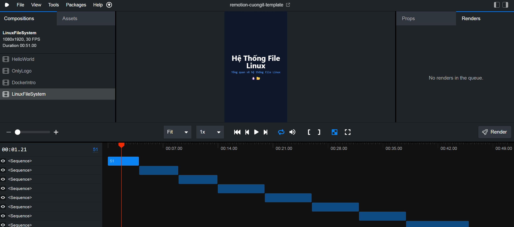

# Remotion CuongIT Template

This repository contains programmatic video templates built with [Remotion](https://www.remotion.dev/), designed for creating educational content for TikTok, YouTube Shorts, and Reels.

## 👨‍💻 Author
**CuongIT**

## 🔔 Follow for more videos
- [TikTok @cuongit96](https://www.tiktok.com/@cuongit96)
- [Facebook Reels](https://www.facebook.com/cuongit96/reels/)

## 📺 Demo Videos

| 🐧 Linux File System | 🐳 Docker Introduction |
|-------------------|---------------------|
| [](https://youtube.com/shorts/VF75KP0kfEA?feature=share) | [](https://youtube.com/shorts/IWGXAhI2N3A?feature=share) |
| [Watch on YouTube](https://youtube.com/shorts/VF75KP0kfEA?feature=share) | [Watch on YouTube](https://youtube.com/shorts/IWGXAhI2N3A?feature=share) |

### 🎙️ Advanced Demo (Voice Integration)
- [Watch on Facebook](https://www.facebook.com/reel/1528707462238368)
- [Watch on Facebook](https://www.facebook.com/reel/3160624830807048)

## 🚀 Features
- **Code-driven animation**: Videos are generated using React and TypeScript.
- **Tailwind CSS**: Styled for rapid and consistent design.
- **TikTok/Shorts Optimized**: 9:16 aspect ratio (1080x1920) with "Safe Zone" padding.
- **Components**: Reusable slides for educational technical content.

## 🛠️ Compositions included
1. **LinuxFileSystem**: A 50s vertical video explaining the Linux Directory Structure (`/`, `/bin`, `/home`, etc.).
2. **DockerIntro**: A vertical video introducing Docker concepts.

## 📦 Installation

1. Clone the repository:
   ```bash
   git clone https://github.com/Cuongyd196/remotion-cuongit-template.git
   cd remotion-cuongit-template
   ```

2. Install dependencies:
   ```bash
   npm install
   ```

## 🎬 Usage

**Start Preview Studio:**
```bash
npm run dev
```



**Render Video:**

You can render a video directly from the Remotion Studio UI (click "Render" on the composition you want to export), or use the command line:
```bash
# Render Linux video
npx remotion render LinuxFileSystem

# Render Docker video
npx remotion render DockerIntro
```

## 📝 License
Licensed under the MIT License.
